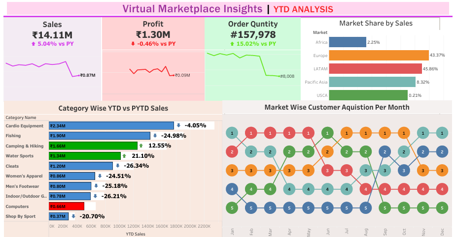

# Virtual Interface Insights Dashboard

An interactive **Tableau dashboard** that provides a 360° view of business performance through data-driven insights.  
This project demonstrates how raw data can be transformed into actionable intelligence for decision-making.

## 📊 Overview
- The **Virtual Interface Insights Dashboard** was designed to help business stakeholders monitor key performance indicators (KPIs), track trends, and make strategic decisions with confidence.  
- It consolidates data from multiple sources into an easy-to-navigate interface, enabling users to drill down into metrics, filter by categories, and uncover hidden patterns.

## 🔑 Key Insights
- **Performance Trends:** Track growth, decline, and seasonality patterns over time.  
- **Customer Segmentation:** Identify high-value customer groups and behavior patterns.  
- **Revenue & Cost Analysis:** Compare revenue streams against expenses for profitability insights.  
- **Forecasting:** Predict future outcomes using historical data trends.  

## 📊 Dashboard Preview

Here’s a snapshot of the **Virtual Interface Insights Dashboard**:

